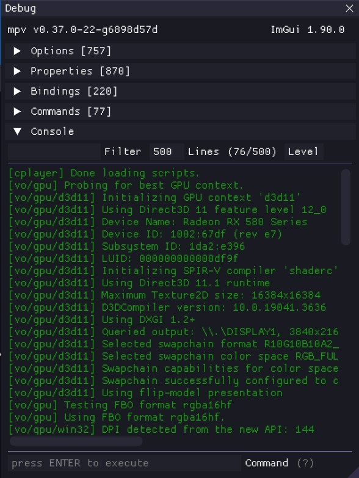

# mpv-debug-plugin

a debug tool for [mpv](https://mpv.io), based on the [C PLUGINS](https://mpv.io/manual/master/#c-plugins) API.



See also [mpv-menu-plugin](https://github.com/tsl0922/mpv-menu-plugin).

## Features

- Visual view of mpv's internal properties
- Console with completion, history support
- Colorful mpv logs view with filter support

## Installation

Download the plugin from Releases.

- **Windows:** mpv >= `0.37.0` is required, place `debug.dll` in your mpv `scripts` folder
- **Linux:** mpv >= `0.24.0` is required, place `debug.so` in your mpv `scripts` folder

Check if the `cplugins` feature is compiled into mpv if the plugin is not loaded.

## Configuration

> **NOTE:** If you changed the dll name, `script-message-to` target should apply too.

Add a keybinding to show debug window (required):

**input.conf**
```
` script-message-to debug show
```

# Credits

- [fmt](https://fmt.dev): A modern formatting library
- [imgui](https://github.com/ocornut/imgui): Bloat-free Graphical User interface for C++ with minimal dependencies
- [ImPlay](https://github.com/tsl0922/ImPlay): This debug tool was extracted from ImPlay

# License

[GPLv2](LICENSE.txt).
